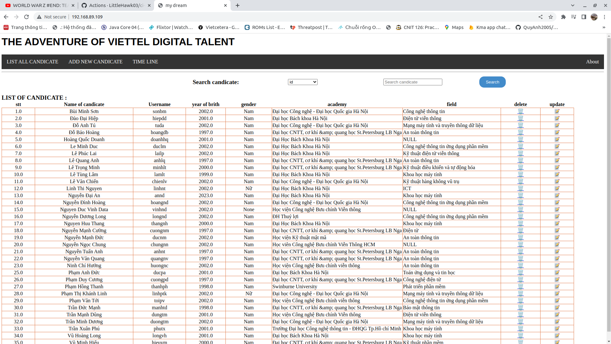
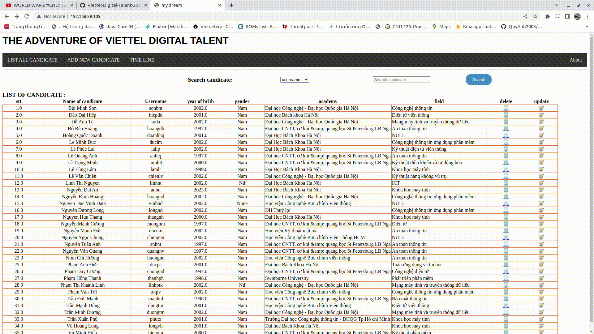

# HOME WORK FROM VIETTEL DIGITAL TALENT

### _LittleHawk03-Nguyễn Mạnh Đức_

####Table of contents

[1. Phát triển một 3-tier web application đơn giản (2đ)]()
  
  Yêu cầu:
  - Viết một CRUD web application đơn giản thực hiện các chức năng:
    - Liệt kê danh sách sinh viên tham gia khóa đào tạo chương trình VDT 2023 lĩnh vực cloud dưới dạng bảng (0.5đ)
    - Cho phép xem chi tiết/thêm/xóa/cập nhật thông tin sinh viên (0.5đ)
  - Thiết kế hệ thống với ba dịch vụ: (0.5đ)
    - web: Giao diện web viết bằng HTML + CSS + Javascript được triển khai trên nền web server nginx
    - api: RESTful API viết bằng ngôn ngữ lập trình tùy chọn (prefer Python), có đầy đủ các chức năng: list, get, create, update, delete các bản ghi thông tin sinh viên
    - db: Database SQL hoặc NoSQL lưu trữ thông tin sinh viên (dữ liệu khởi tạo của DB này được cho bởi bảng trong Phụ lục I.)
  - Viết unit tests cho các chức năng APIs (0.5đ)

  Output:
  - Mã nguồn của từng dịch vụ
  

# 1. Phát triển một 3-tier web application đơn giản (2đ)

#### 1.1 Viết một CRUD web application đơn giản thực hiện các chức năng

##### 1.1.1 Liệt kê danh sách sinh viên tham gia khóa đào tạo chương trình VDT 2023 lĩnh vực cloud dưới dạng bảng (0.5đ)

For this request I have designed a website that lists the candidates in the form of a table

  

  <i>list all cadidate</i>

##### 1.1.2 Cho phép xem chi tiết/thêm/xóa/cập nhật thông tin sinh viên (0.5đ)

And my website have some feature : view detail, search, delete, update, add new candidate

- **search**:

  

  <i>search cadidate</i>

- **delete**

  

  <i>delete cadidate</i>

  
- **update**

  

  <i>update cadidate</i>

- **add new candidate**

  

  <i>add new cadidate</i>

#### 1.2  Thiết kế hệ thống với ba dịch vụ: (0.5đ)

##### 1.2.1 web: Giao diện web viết bằng HTML + CSS + Javascript được triển khai trên nền web server nginx

- source code of web in [web](./web)